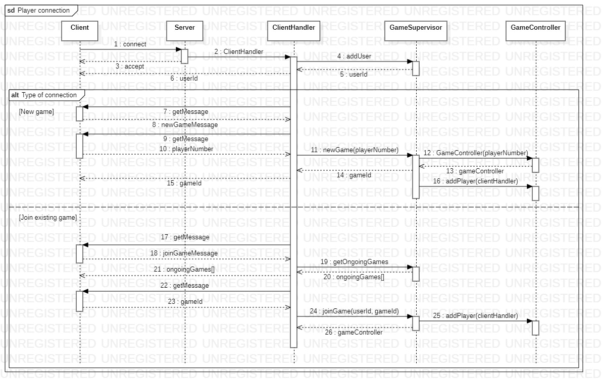
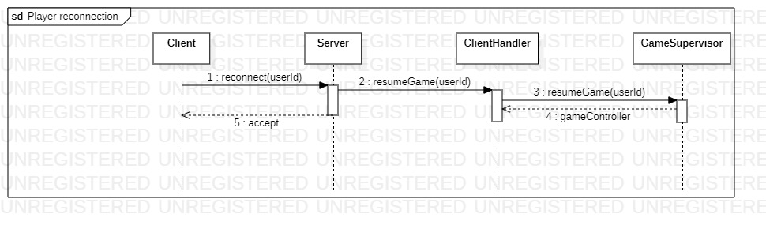
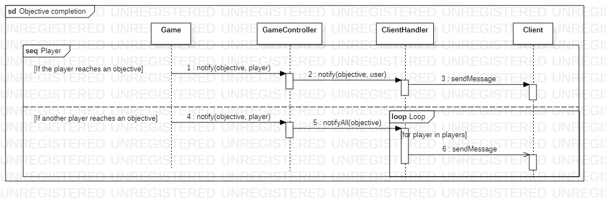
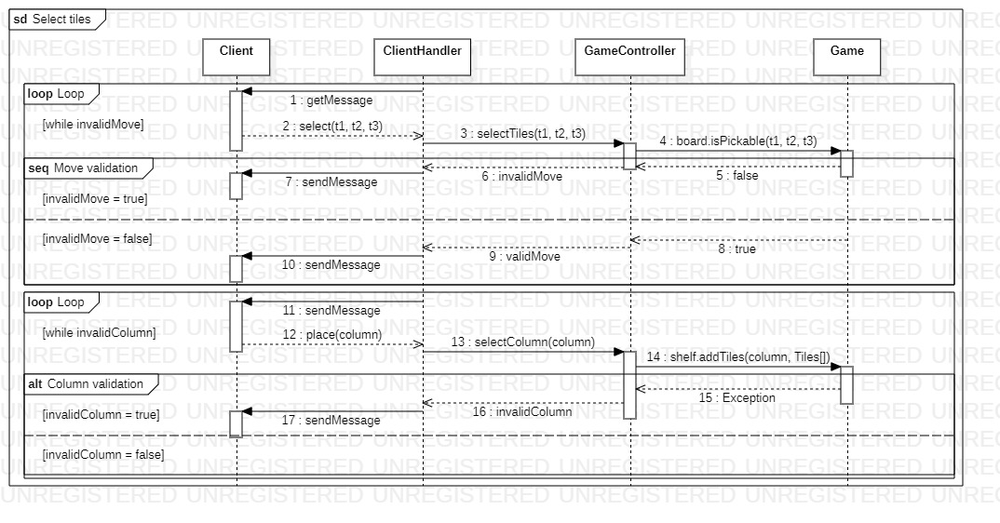

# Client-Server interaction diagrams

This document is provided with the UML interaction diagrams in order to make them clearer to the reader.

## Player Connection

This diagram represents the first connection of a player to the game server.

Once the client is started, it tries to connect to the provided hostname and port to the game server. When the game server accepts that connection, a new `ClientHandler` thread is started, which will then add the user to the list of currently connected users in the `GameSupervisor` class. Once this is done, the client receives a unique `userId`, which will be a hash of the salted player username.

Once the client is connected to the server, two options are available:

- New Game
- Join Game

When creating a new game, the client sends a new game command to the corresponding client handler, then the client handler asks the user how many players will be in that game. Once this information is delivered to the client handler, it creates a new game through the method `newGame` and the game supervisor sets up the game by creating a new `GameController`, which is then assigned a unique `gameId` that is returned to the player.

When joining an existing game, the client asks the client handler what games are currently ongoing on the same server. This information is returned as an array of `gameId`s. The client can then choose among the ongoing games which one to partake in. When this information is sent to the client handler, the `joinGame` method is called on the game supervisor and the game's corresponding game controller is returned to the client handler.

## Player Reconnection

When attempting to reconnect to the former game, the player first reconnects to the server. The server hands over the connection to a new instance of `ClientHandler`. The new client handler will ask the client if it wants to log in as a new player or an exsisting player; if the client chooses to be connected as an exsisting player, it will then be brought back to its original game. The original game is retrieved by the `GameSupervisor` using the old `userId`.

## Objective completion

When the player reaches one of the objectives, the `Game` class, in the `server.model` package, notifies the game controller, which then sends the message to the `View` in order to let the player know about it.

## Select tiles

The client receives two messages: one to select the tiles to pick and another one to choose the column of the shelf where to place the selected tiles. `sendMessage` is used to request input from the players or to notify them of the acceptance or rejection of their choices.